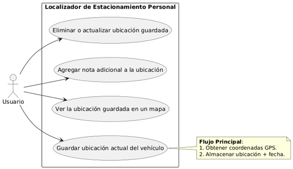
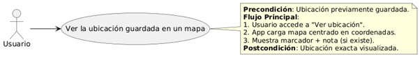
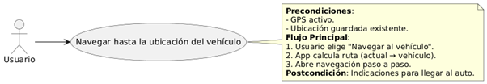
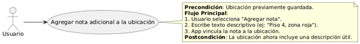
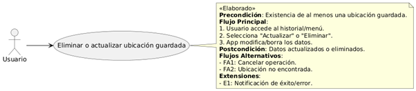
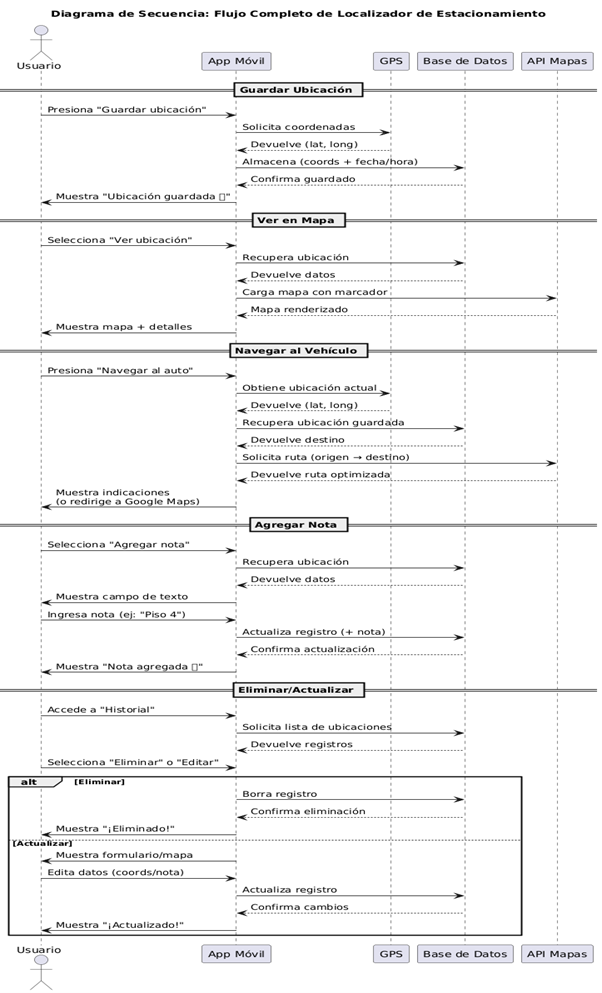
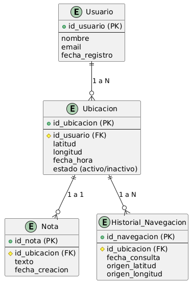
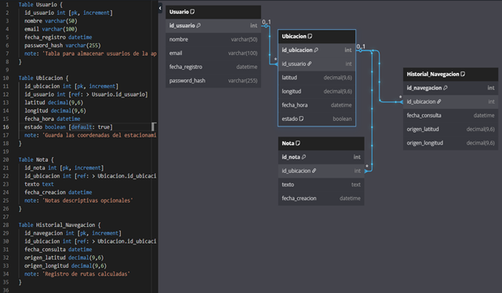

# Localizador de Estacionamiento Personal

## Integrantes del Grupo

Este proyecto fue desarrollado por un grupo de estudiantes comprometidos con la creación de una solución práctica para facilitar la ubicación de vehículos estacionados. Los miembros del equipo son:

* Galeano Joaquin
* Lopez Sebastian
* Pradier Lucas
* Vera Franco

## CASOS DE USO e HISTORIAS DE USUARIO

### ✅ Caso de Uso 1: Guardar ubicación actual del vehículo
* **Actor principal:** Usuario de la aplicación
* **Objetivo:** Almacenar la ubicación GPS actual donde estacionó el auto
* **Precondiciones:** El GPS del dispositivo debe estar activo
* **Flujo principal:**
    1.  El usuario abre la app.
    2.  Presiona el botón “Guardar ubicación”.
    3.  La app obtiene las coordenadas GPS.
    4.  La app almacena la ubicación con fecha y hora.
* **Postcondiciones:** La ubicación queda guardada y lista para ser visualizada o usada en navegación.
* **🔹 Historia de usuario:** Como conductor que frecuenta zonas concurridas, quiero guardar mi ubicación al momento de estacionar, para poder volver fácilmente a mi vehículo más tarde.

### ✅ Caso de Uso 2: Ver la ubicación guardada en un mapa
* **Actor principal:** Usuario
* **Objetivo:** Visualizar en un mapa la ubicación en la que estacionó
* **Precondiciones:** Debe haber una ubicación guardada previamente
* **Flujo principal:**
    1.  El usuario accede a la opción “Ver ubicación”.
    2.  La app carga un mapa centrado en la ubicación almacenada.
    3.  Se muestra un marcador con detalles como la nota adicional (si la hay).
* **Postcondiciones:** El usuario visualiza el punto exacto donde dejó su vehículo.
* **🔹 Historia de usuario:** Como usuario distraído, quiero ver en un mapa dónde dejé el auto, para identificar visualmente su ubicación exacta.

### ✅ Caso de Uso 3: Navegar hasta la ubicación del vehículo
* **Actor principal:** Usuario
* **Objetivo:** Obtener direcciones desde su ubicación actual hasta el vehículo
* **Precondiciones:** GPS activo y ubicación guardada existente
* **Flujo principal:**
    1.  El usuario elige “Navegar al vehículo”.
    2.  La app calcula la ruta desde la posición actual al punto guardado.
    3.  Se abre la navegación paso a paso (integrada o vía app externa como Google Maps).
* **Postcondiciones:** El usuario recibe indicaciones para llegar al auto.
* **🔹 Historia de usuario:** Como visitante de un centro comercial grande, quiero recibir indicaciones desde donde estoy hasta mi auto, para no perder tiempo buscándolo.

### ✅ Caso de Uso 4: Agregar nota adicional a la ubicación
* **Actor principal:** Usuario
* **Objetivo:** Asociar un texto descriptivo a la ubicación guardada
* **Precondiciones:** Se debe haber guardado la ubicación
* **Flujo principal:**
    1.  El usuario selecciona “Agregar nota”.
    2.  Escribe información como “Piso 4, zona roja”.
    3.  La app guarda y vincula la nota a la ubicación.
* **Postcondiciones:** La ubicación cuenta con una descripción adicional útil para el usuario.
* **🔹 Historia de usuario:** Como conductor que estaciona en lugares grandes o con pisos, quiero escribir una nota como “Nivel -2, cerca del ascensor” para recordar detalles visuales del lugar exacto.

### ✅ Caso de Uso 5: Eliminar o actualizar ubicación guardada
* **Actor principal:** Usuario
* **Objetivo:** Modificar o eliminar la ubicación guardada
* **Precondiciones:** Debe existir una ubicación guardada
* **Flujo principal:**
    1.  El usuario entra al historial o menú principal.
    2.  Selecciona la opción “Actualizar” o “Eliminar”.
    3.  La app modifica la información o borra los datos del almacenamiento.
* **Postcondiciones:** La ubicación se actualiza o elimina según la acción tomada.
* **🔹 Historia de usuario:** Como usuario habitual de la app, quiero actualizar la ubicación si cambié de lugar de estacionamiento o eliminarla si ya no la necesito.

## ✅ REQUISITOS FUNCIONALES (RF)

1.  **Gestión de Ubicaciones**
    * RF1 : Guardar ubicación actual del vehículo con coordenadas GPS, fecha y hora exacta. (Alta prioridad) 
    * RF2 : Agregar o editar notas descriptivas asociadas a la ubicación (ej: “Zona verde, entrada lateral”). 
    * RF3 : Permitir eliminar o actualizar ubicaciones guardadas, de forma individual o por selección múltiple. (Alta) 
2.  **Visualización**
    * RF4 : Mostrar las ubicaciones en un mapa interactivo con marcadores y detalles al tocar. (Alta) 
    * RF5 : Permitir filtrar ubicaciones por fecha, etiquetas o palabras clave. (Baja) 
3.  **Navegación**
    * RF6 : Calcular la ruta desde la ubicación actual hasta el vehículo usando GPS. (Alta) 
    * RF7 : Ofrecer integración con apps de terceros como Google Maps o Waze para guía paso a paso. (Media)
4.  **Historial y Sincronización**
    * RF8 : Mantener un historial de ubicaciones anteriores con capacidad de búsqueda por fecha o texto. (Media) 
    * RF9 : Sincronizar los datos con una cuenta en la nube (Firebase, Google Drive, iCloud) para respaldo y acceso desde múltiples dispositivos. (Baja) 
5.  **Alertas y Automatización**
    * RF10 : Enviar notificación si el usuario se aleja del vehículo sin guardar su ubicación. (Opcional) 

## 🔒 REQUISITOS NO FUNCIONALES (RNF)

1.  **Rendimiento**
    * RNF1 : El sistema debe guardar o recuperar la ubicación en menos de 2 segundos. (Crítico)
    * RNF2 : El consumo de batería debe ser optimizado, especialmente cuando la app está en segundo plano. (Alta)
2.  **Usabilidad**
    * RNF3 : Interfaz intuitiva siguiendo principios de Material Design (Android) o Human Interface Guidelines (iOS). (Alta)
    * RNF4 : Accesibilidad: modo oscuro, contraste elevado y compatibilidad con lectores de pantalla. (Media) 
3.  **Seguridad**
    * RNF5 : Cifrado de datos sensibles (coordenadas, notas) tanto en tránsito como en almacenamiento local. (Alta) 
    * RNF6 : Autenticación opcional mediante biometría (huella digital o reconocimiento facial). (Media) 
4.  **Compatibilidad**
    * RNF7 : Soporte para Android (API 26+) y iOS (iOS 14+). (Alta) 
    * RNF8 : Capacidad de operar sin conexión a internet, guardando la ubicación localmente hasta que haya conexión. (Media) 
5.  **Escalabilidad**
    * RNF9 : Estructura modular para permitir futuras funcionalidades como compartir ubicación o recordatorios inteligentes. (Baja) 

## 📊 PRIORIZACIÓN

| Tipo            | Alta                     | Media                  | Baja/Opcional          |
| --------------- | ------------------------ | ---------------------- | ---------------------- |
| Funcionales     | RF1, RF3, RF4, RF6       | RF2, RF7, RF8          | RF5, RF9, RF10         |
| No Funcionales | RNF1, RNF2, RNF3, RNF5 | RNF4, RNF6, RNF7, RNF8 | RNF9                   | 

## 🧪 EJEMPLOS DE CASOS DE PRUEBA

* RF1 + RNF1
    * Escenario : El usuario pulsa el botón “Guardar ubicación” con señal GPS débil. 
    * Resultado esperado : La app almacena las coordenadas aproximadas en menos de 2 segundos y muestra una notificación de éxito.
* RNF2
    * Escenario : La app permanece abierta en segundo plano por 2 horas mientras se mantiene el GPS activo.
    * Resultado esperado : El consumo de batería no debe superar el 7%. 
* RF6 + RNF8
    * Escenario : El usuario intenta ver la ruta hacia su vehículo sin conexión a internet.
    * Resultado esperado : Se muestra una alerta de conectividad o se ofrece una ruta previamente guardada.

## 🔧 HERRAMIENTAS RECOMENDADAS

* IDE : Android Studio (Kotlin) o Xcode (Swift) 
* API de mapas : Google Maps SDK / MapKit 
* Back-end / Sync : Firebase Realtime Database o Firestore 
* Encriptación : AES-256 (con SQLCipher o Keystore) 
* Testing : JUnit para lógica, Espresso/Appium para interfaz 

## DESARROLLO E IMPLEMENTACIÓN DE LA BASE DE DATOS

Este es el diagrama Entidad Relación del proyecto, diseñado para cubrir todos los casos de usos mencionados anteriormente en el proyecto.
Usamos el modelo SQL con tablas claves y relación. 

